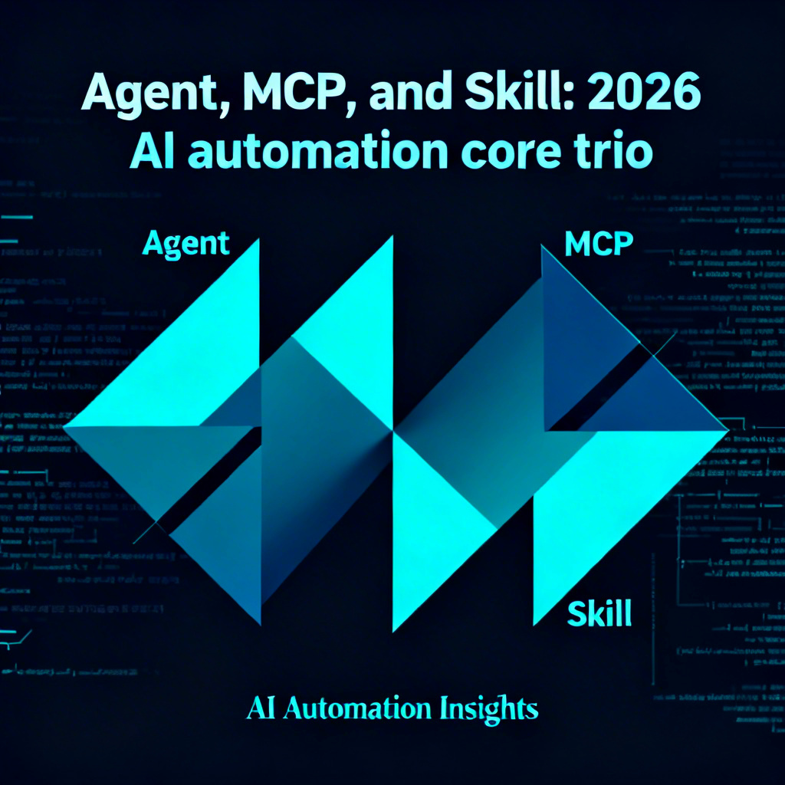
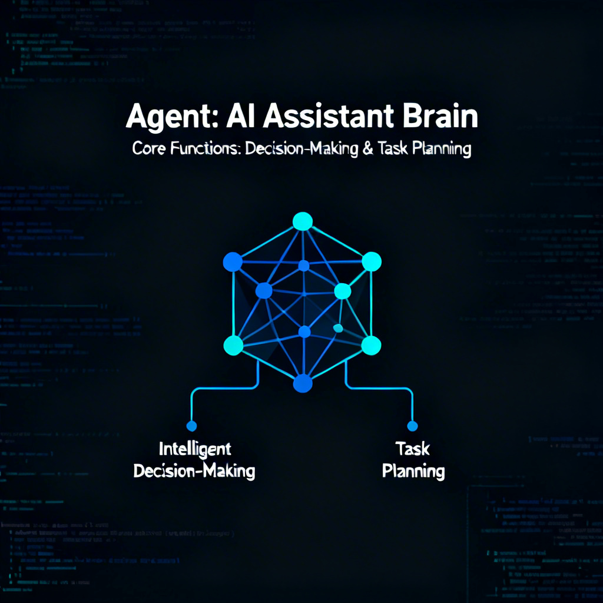
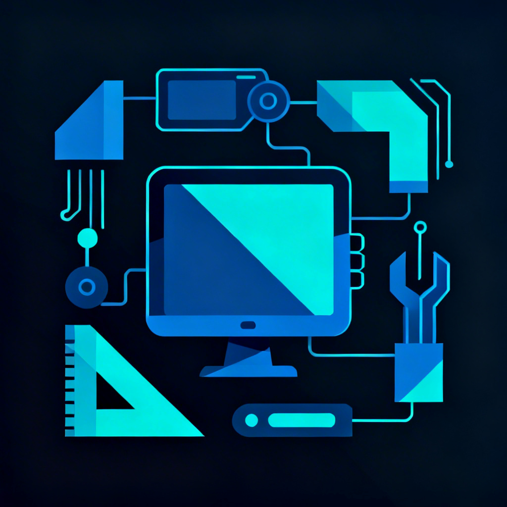

# 一文读懂Agent、MCP、Skill：2026年AI自动化核心三剑客

## 文章简介
你有没有过这样的经历？每天被报表、数据查询和客服回复这些重复工作填满，明明有AI工具却总觉得用着不顺手。要么是不同工具格式不统一，要么是复杂任务需要反复手动干预，成本还高得吓人。2026年，Agent、MCP和Skill这三个技术的组合正在改变这种局面。

## 封面图

**Prompt:**
A professional wechat article cover image about Agent, MCP, and Skill: 2026 AI automation core trio. Tech minimalistic style, dark code theme, geometric, clean, suitable for professional audience. High quality, detailed, horizontal layout, dark blue and cyan color scheme.

**图片:**

## 文中配图

### 配图 1

**Prompt:**
An illustration showing AI technology background and pain points. Tech minimalistic style, dark theme, showing disconnected systems and tools, geometric shapes, clean vector, suitable for wechat article, horizontal layout.

**图片:**

### 配图 2

**Prompt:**
An illustration explaining Agent as AI assistant brain. Tech minimalistic style, dark code theme, showing intelligent decision-making and task planning, geometric nodes, clean vector, dark blue and cyan color scheme, suitable for wechat article, horizontal layout.

**图片:**

### 配图 3

**Prompt:**
An illustration showing MCP as universal interface connecting Agent and Skill. Tech minimalistic style, dark code theme, showing protocol bridges and scheduling, geometric connections, clean vector, dark blue and cyan color scheme, suitable for wechat article, horizontal layout.

**图片:**

